# 🏗️ System Architecture - File Interaction Diagram

## 📊 Complete System Flow

```mermaid
graph TB
    %% User Entry Points
    USER[👤 User] --> MONITOR[monitor.py<br/>🎯 Main Interface]
    USER --> ENHANCED[enhanced_dashboard.py<br/>🔍 Advanced Dashboard]
    USER --> SCRIPTS[scripts/<br/>📜 Direct Scripts]

    %% Main Interface Flow
    MONITOR --> COLLECTOR[core/comprehensive_collector.py<br/>📊 Data Collection]
    MONITOR --> SCENARIO[core/scenario_monitoring.py<br/>🚨 Pattern Detection]
    MONITOR --> WEBAPP[dashboard_webapp.py<br/>📈 Original Dashboard]

    %% Core System Components
    COLLECTOR --> GOVMON[core/government_monitor_system.py<br/>🏛️ Core Monitor Engine]
    COLLECTOR --> ENHANCED_COLL[archive/enhanced_collectors.py<br/>📡 Multi-Source Collectors]
    COLLECTOR --> MISSING_COLL[archive/missing_sources_collectors.py<br/>🔍 Additional Sources]

    %% Dashboard Components
    ENHANCED --> DB[(government_monitor.db<br/>💾 SQLite Database)]
    WEBAPP --> DB
    SCENARIO --> DB
    GOVMON --> DB

    %% Scripts Directory
    SCRIPTS --> RUN_CRONY[run_cronyism_detection.py]
    SCRIPTS --> RUN_DASH[run_dashboard.py]
    SCRIPTS --> RUN_DAILY[run_daily_collection.py]
    SCRIPTS --> RUN_ENH[run_enhanced_collection.py]
    SCRIPTS --> RUN_ULT[run_ultimate_collection.py]

    %% Script Dependencies
    RUN_CRONY --> COLLECTOR
    RUN_CRONY --> SCENARIO
    RUN_DASH --> WEBAPP
    RUN_DAILY --> GOVMON
    RUN_ENH --> GOVMON
    RUN_ENH --> ENHANCED_COLL
    RUN_ULT --> COLLECTOR

    %% External Data Sources
    GOVMON --> API1[🌐 USASpending.gov API]
    ENHANCED_COLL --> API2[🌐 Federal Register]
    ENHANCED_COLL --> API3[🌐 Agency Press Releases]
    MISSING_COLL --> API4[🌐 Small Business Contracts]
    MISSING_COLL --> API5[🌐 Additional Gov Sources]

    %% Archive Components
    ARCHIVE[archive/<br/>📦 Development Files] --> ENHANCED_COLL
    ARCHIVE --> MISSING_COLL
    ARCHIVE --> SETUP[setup_files.py]

    %% Styling
    classDef userEntry fill:#e1f5fe,stroke:#01579b,stroke-width:3px
    classDef coreSystem fill:#f3e5f5,stroke:#4a148c,stroke-width:2px
    classDef dashboard fill:#e8f5e8,stroke:#1b5e20,stroke-width:2px
    classDef scripts fill:#fff3e0,stroke:#e65100,stroke-width:2px
    classDef database fill:#ffebee,stroke:#b71c1c,stroke-width:3px
    classDef external fill:#f1f8e9,stroke:#33691e,stroke-width:1px
    classDef archive fill:#fafafa,stroke:#424242,stroke-width:1px

    class USER,MONITOR,ENHANCED userEntry
    class COLLECTOR,SCENARIO,GOVMON coreSystem
    class WEBAPP,ENHANCED dashboard
    class SCRIPTS,RUN_CRONY,RUN_DASH,RUN_DAILY,RUN_ENH,RUN_ULT scripts
    class DB database
    class API1,API2,API3,API4,API5 external
    class ARCHIVE,ENHANCED_COLL,MISSING_COLL,SETUP archive
```

## 🔄 Data Flow Explanation

### 1. **Entry Points**
- **`monitor.py`** - Main interactive interface (recommended)
- **`enhanced_dashboard.py`** - Advanced cronyism dashboard
- **`scripts/`** - Direct script execution

### 2. **Core Processing Layer**
- **`comprehensive_collector.py`** - Orchestrates all data collection
- **`government_monitor_system.py`** - Core monitoring engine
- **`scenario_monitoring.py`** - Pattern detection and analysis

### 3. **Data Collection Layer**
- **`enhanced_collectors.py`** - Multi-source data collectors
- **`missing_sources_collectors.py`** - Additional government sources
- **External APIs** - Government data sources

### 4. **Presentation Layer**
- **`dashboard_webapp.py`** - Original Flask dashboard
- **`enhanced_dashboard.py`** - Advanced cronyism dashboard
- **SQLite Database** - Central data storage

### 5. **Utility Scripts**
- **`run_cronyism_detection.py`** - Full pattern analysis
- **`run_dashboard.py`** - Launch web interface
- **`run_daily_collection.py`** - Daily data updates
- **`run_enhanced_collection.py`** - Enhanced data gathering
- **`run_ultimate_collection.py`** - Maximum data collection

## 🎯 Key Interactions

### **Main Workflow:**
1. User runs `monitor.py`
2. Calls `comprehensive_collector.py` for data
3. Uses `scenario_monitoring.py` for analysis
4. Stores results in `government_monitor.db`
5. Displays via dashboards

### **Dashboard Workflow:**
1. User accesses dashboard (enhanced or original)
2. Dashboard queries `government_monitor.db`
3. Renders interactive visualizations
4. Provides real-time pattern analysis

### **Data Collection Workflow:**
1. `comprehensive_collector.py` orchestrates collection
2. Calls `government_monitor_system.py` for core data
3. Uses archive collectors for additional sources
4. Deduplicates and stores in database
5. Triggers pattern analysis

## 📁 File Dependencies Summary

| File | Depends On | Purpose |
|------|------------|---------|
| `monitor.py` | comprehensive_collector, scenario_monitoring, dashboard_webapp | Main interface |
| `enhanced_dashboard.py` | government_monitor.db, plotly, flask | Advanced dashboard |
| `dashboard_webapp.py` | government_monitor.db, plotly, flask | Original dashboard |
| `comprehensive_collector.py` | government_monitor_system, enhanced_collectors | Data orchestration |
| `scenario_monitoring.py` | government_monitor.db | Pattern detection |
| `government_monitor_system.py` | External APIs, SQLite | Core engine |

## 🔧 System Architecture Benefits

### **Modular Design**
- Clear separation of concerns
- Easy to maintain and extend
- Independent component testing

### **Scalable Data Collection**
- Multiple source integration
- Automatic deduplication
- Rate limiting and error handling

### **Flexible Analysis**
- Pattern-based detection
- Configurable thresholds
- Historical trend analysis

### **User-Friendly Interface**
- Multiple access methods
- Interactive dashboards
- Automated workflows
